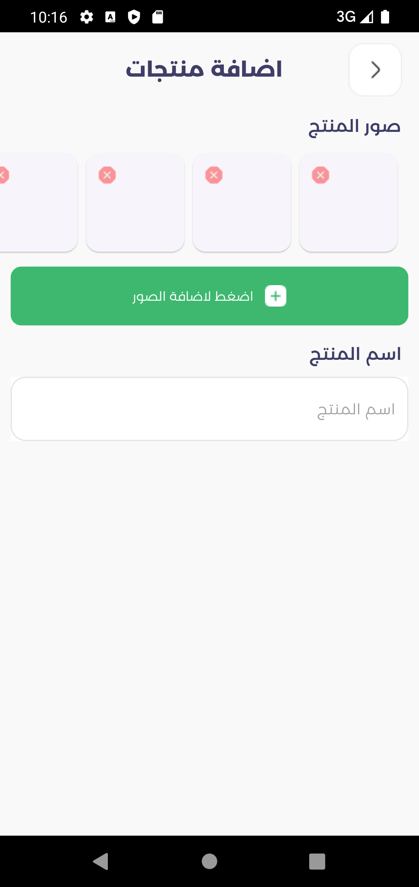
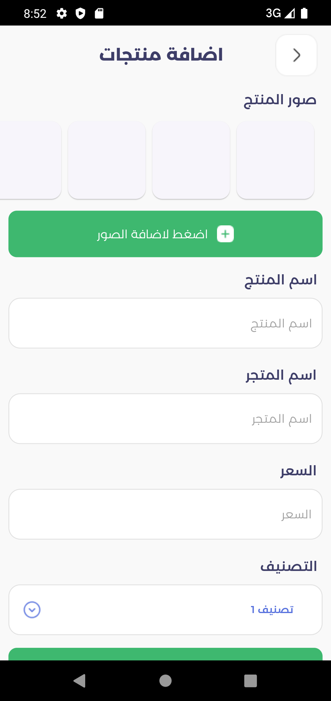

# Project Overview

This project is a coding test for Jacksi LTD company. The main focus of the project is to implement a Flutter application that demonstrates various concepts including architecture using BLoC pattern with Freezed, integrating third-party libraries, and more.

## Architecture

The project follows the BLoC pattern for managing the state of the application, making use of the `flutter_bloc` library for state management and `freezed` for generating immutable classes.

Key libraries used:
- `flutter_bloc: ^8.0.1`
- `freezed`

## Libraries Used

The project utilizes the following libraries to enhance functionality and streamline development:

- `flutter_bloc: ^8.0.1` - A state management library that helps manage and handle the application's state using the BLoC pattern.
- `realm: ^1.3.0` - A database library used for local data storage and management.
- `get_it: ^7.6.0` - A dependency injection library that helps manage and provide instances of dependencies throughout the application.
- `image_picker: ^1.0.2` - A library that provides the ability to pick images from the device's gallery or camera.

## Getting Started

To get started with the project, follow these steps:

1. Clone the repository to your local machine.
2. Install the required dependencies using `flutter pub get`.
3. Generate Freezed classes using `flutter pub run build_runner build`.
4. Run the application using `flutter run`.

## Screenshots

Here are some screenshots from the application:

_Description of screenshot 1._

_Description of screenshot 2._

<!-- Add more screenshots and descriptions as needed. -->

Feel free to customize and expand the template according to your project's specific details and requirements. Good luck with your coding test for Jacksi LTD company!